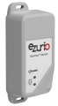
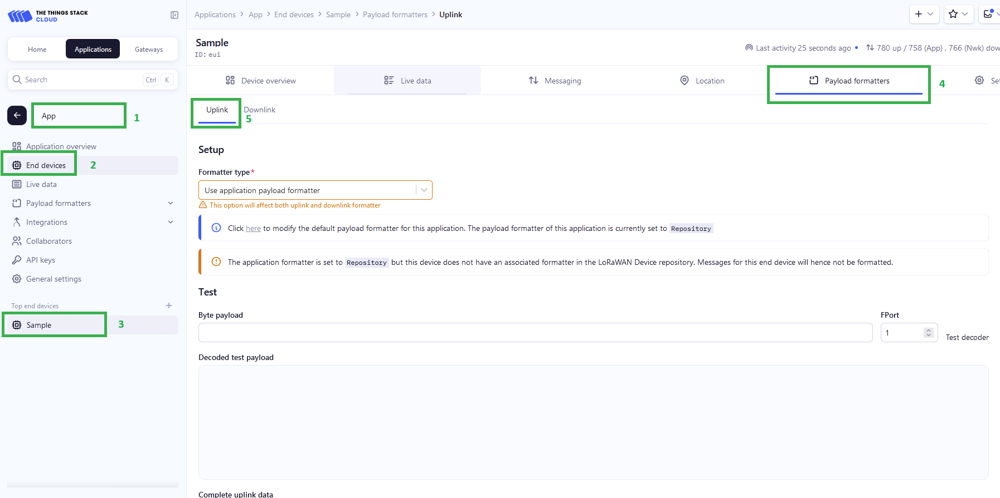
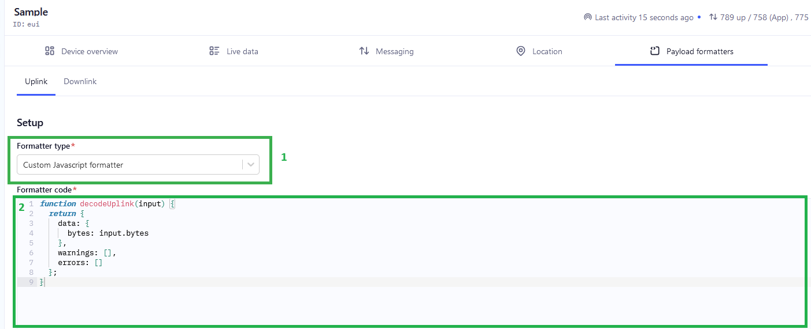
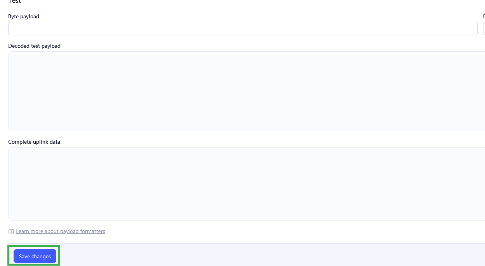
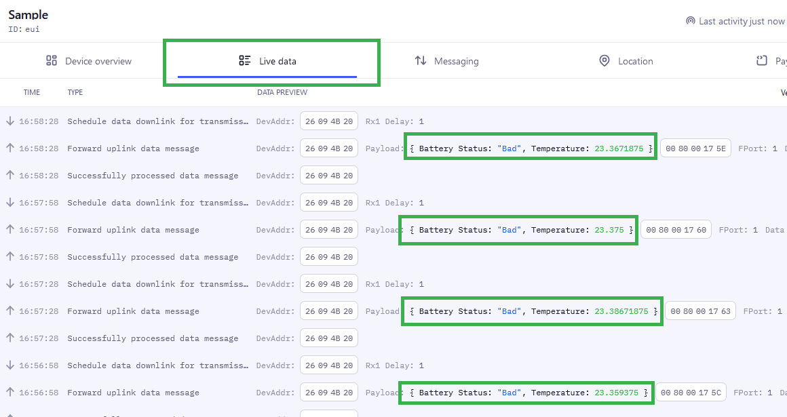
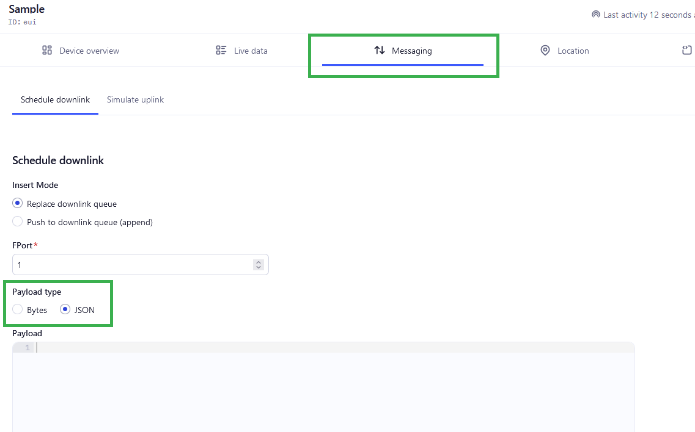
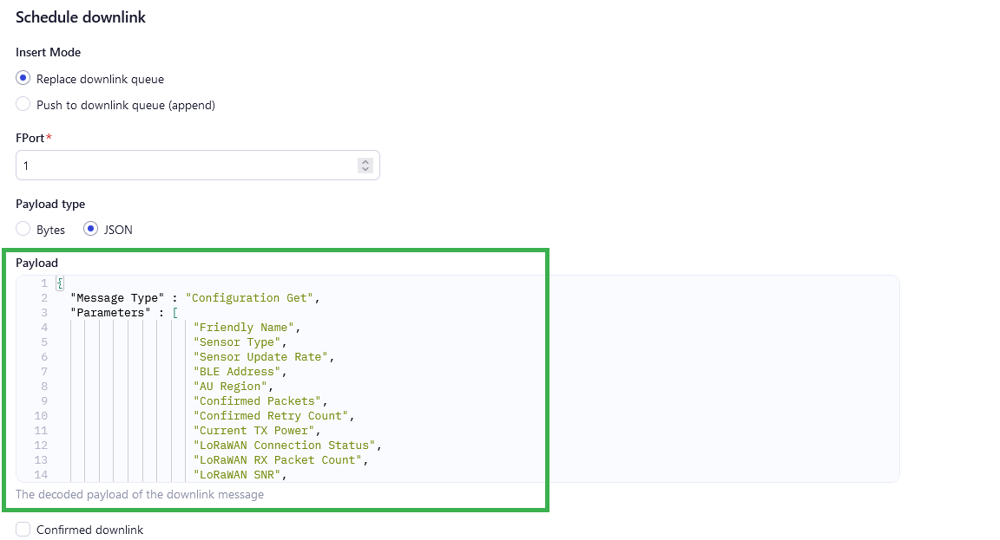
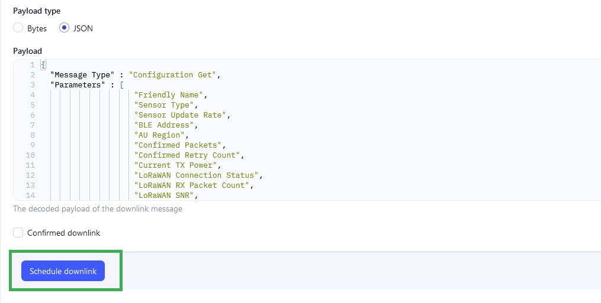
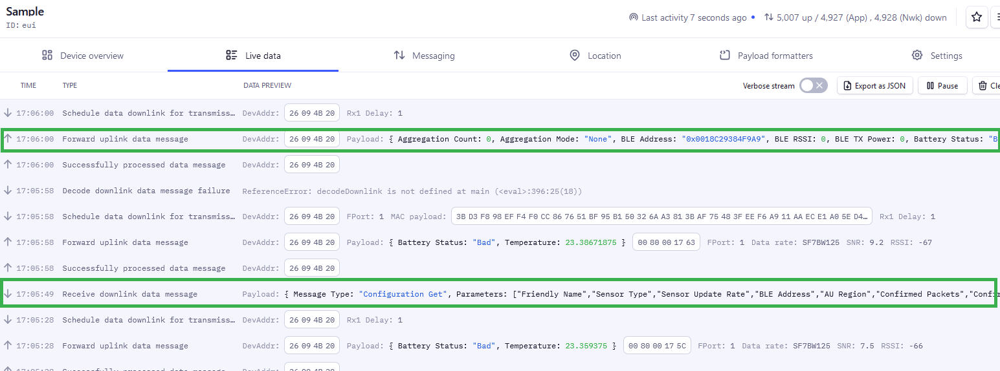

# RS26x TTI Codec

This is the release page for the Ezurio [RS26x][RS26x product brief] product family Codec for TTI. 

# Contents

This repository includes the following files.

| File Name                                                  | Description                                      |
|------------------------------------------------------------|--------------------------------------------------|
| [Downlink_TTI.js](Downlink_TTI.js)                         | Downlink Encoder with commented JavaScript code. |
| [Downlink_TTI_Uncommented.js](Downlink_TTI_Uncommented.js) | Downlink Encoder with comments removed.          |
| [Uplink_TTI.js](Uplink_TTI.js)                             | Uplink Decoder with commented JavaScript code.   |
| [Uplink_TTI_Uncommented.js](Uplink_TTI_Uncommented.js)     | Uplink Decoder with comments removed.            |

Uncommented files are intended for integration within TTI. Commented versions are provided for developer reference. A character count limitation enforced by TTI results in file size needing to be minimized, with comments being included in the character count.

# Integration

Codec integration is performed on a per device basis. From within the TTI instance user interface, the Application where the device to add codec support for resides should be navigated to. The device should then be selected from the 'End devices' option and then the 'Payload formatters' tab selected.

Within the 'Payload formatters' tab, 'Uplink' and 'Downlink' tabs are available for selection. The 'Uplink' tab is selected for determining the 'Payload formatter' of uplink messages and the 'Downlink' tab selected for downlink messages.

The sequence of steps to arrive at the 'Uplink' 'Payload formatters' tab is shown below.

The 'Formatter type' dropdown should be set to 'Custom Javascript formatter', then the code from the appropriate Uncommented codec file pasted into the 'Formatter code' pane as shown below.

Once the code has been pasted into the 'Formatter code' pane, towards the foot of the page, 'Save changes' must be clicked before navigating away from the page as shown below.

The steps described above must be repeated for each codec type being installed.

# Viewing decoded uplink data

Following integration of the Uplink decoder, messages received from the device are decoded automatically, with the results visible in the 'Live data' tab associated with the device as shown below.

# Sending downlinks to the device

From the 'Messaging' tab associated with the device, 'Schedule downlink' should be selected, then the 'Payload type' set to JSON, as shown below. This allows messages to be described in JSON format. The [RS26x LoRa Protocol][RS26x LoRa Protocol] specification should be referred to for details of the expected JSON format.

The message to be sent to the device should be entered in JSON format in the 'Payload' pane as shown below.

Once entered, the 'Schedule downlink' button at the foot of the page should be clicked as shown below.

# Viewing decoded downlink data

The queued downlink is sent to the device on the next available receive window following an uplink from the device. Decoded downlink data and the decoded response appears as shown below in the 'Messaging' tab associated with the device.

[RS26x product brief]: <https://www.ezurio.com/documentation/product-brief-rs26x-sensor>
[RS26x LoRa Protocol]: <https://www.ezurio.com/documentation/application-note-lora-protocol-rs26x-series>